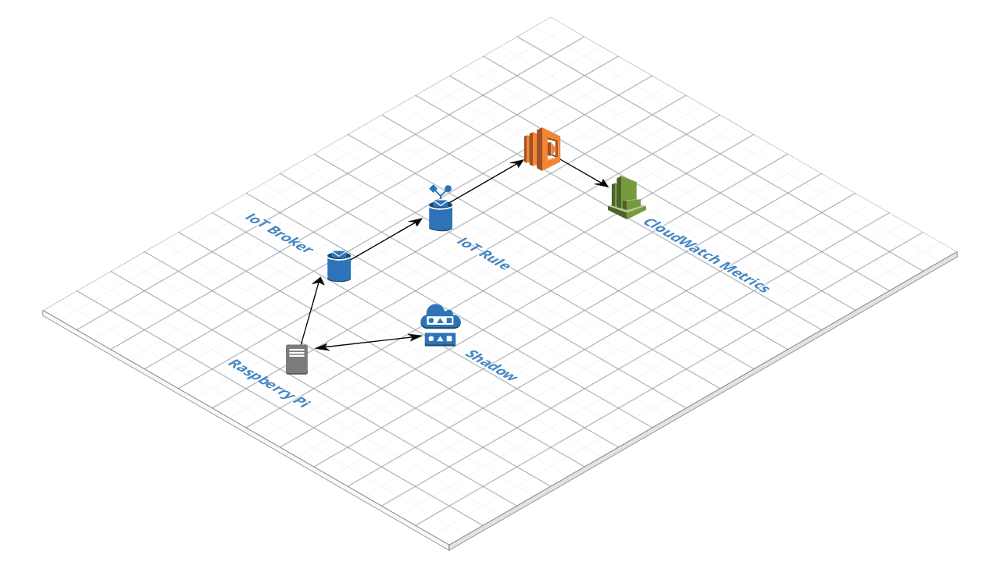
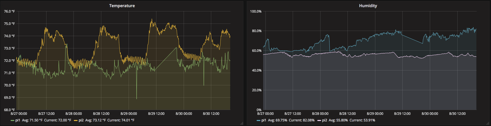

# Serverless Raspberry PI IoT Temperature System
Using Raspberry PI to connect to AWS IoT over MQTT which publishes messages that are forwarded to Lambda function and saved as a custom CloudWatch metric.

Note: this is a Work in progress. Still working through how to make this easier to setup.

## Content:
- [Raspberry Pi Initial Setup](./docs/setup-pi.md)
- [Raspberry Pi Application Setup](./docs/setup-application.md)
- [Sensor Info](./docs/sensor.md)
- [Serverless App](./serverless/README.md)

---

### System Overview:

### Grafana Dashboard:
Using Grafana to pull in CloudWatch metrics

---

## TODO
- Simplify device setup. Maybe single makefile or bash script
- Set environment variables in `/etc/environment` to prevent having to pass to application.
- Is MQTT the best protocol for this? Not really using the Device Shadow. Maybe just HTTP POSTs would be simplier.
