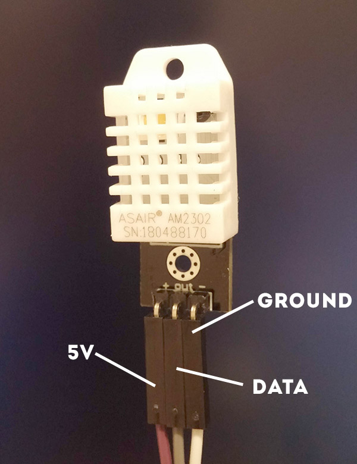

# Sensor Info

Originally used the [DHT11](https://www.amazon.com/gp/product/B01H3J3H82/ref=oh_aui_search_detailpage?ie=UTF8&psc=1) but wanted something more accurate so went with [AM2302 Temperature & Humidity Sensor](https://www.amazon.com/gp/product/B073F472JL/ref=oh_aui_detailpage_o02_s00?ie=UTF8&psc=1)

### AM2302 Wiring
